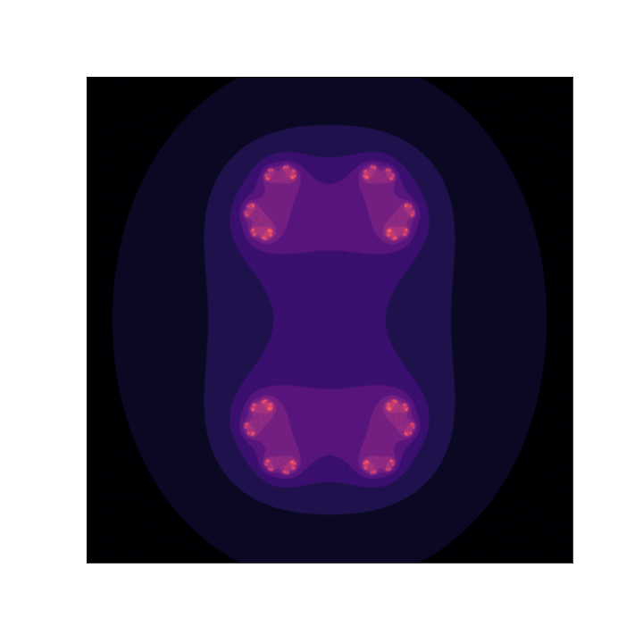

# Visualizar Fractales Complejos

Sirve para generar gif/mp4 de fractales complejos (mandelbrot y julia).

Dependiendo de las caractareísticas de tu equipo, se tardará unos minutos en crearlos

Para el formato gif se utiliza el writer "imagemagick" desde la librería de animación de matplotlib, así que será necesario que lo instales si lo quieres replicar

## Julia

